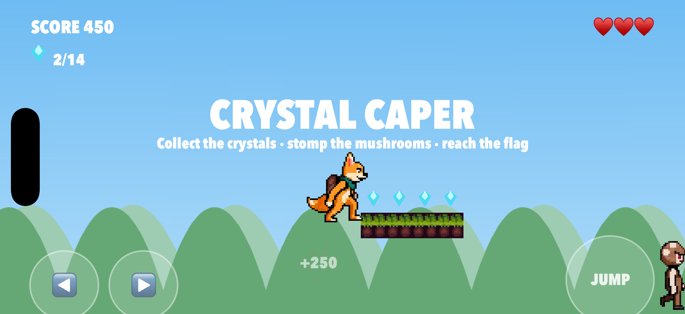
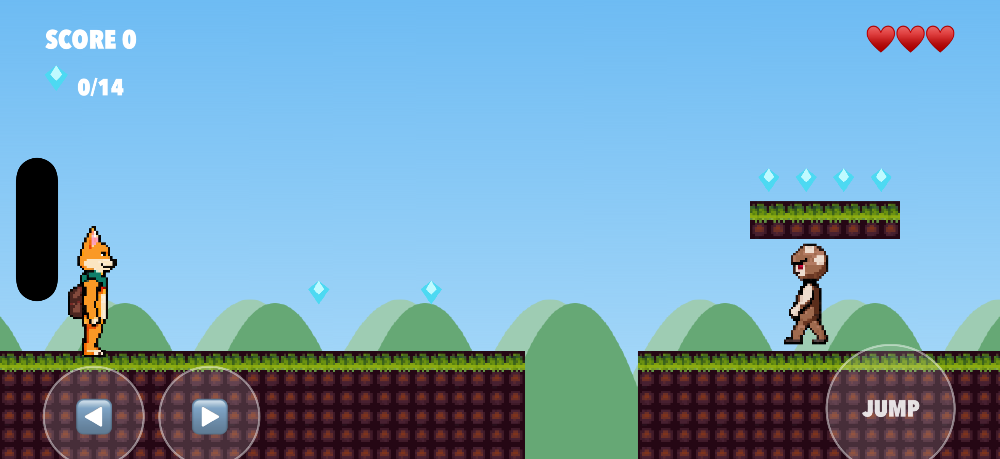
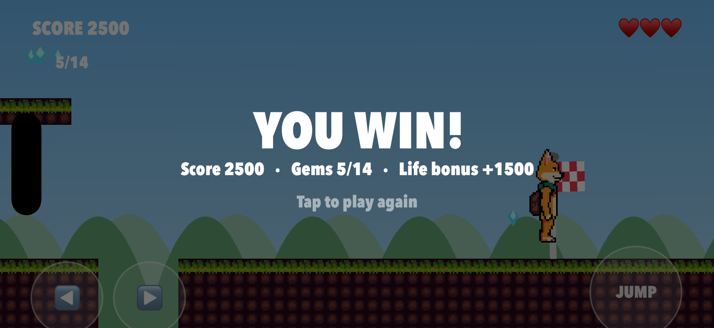
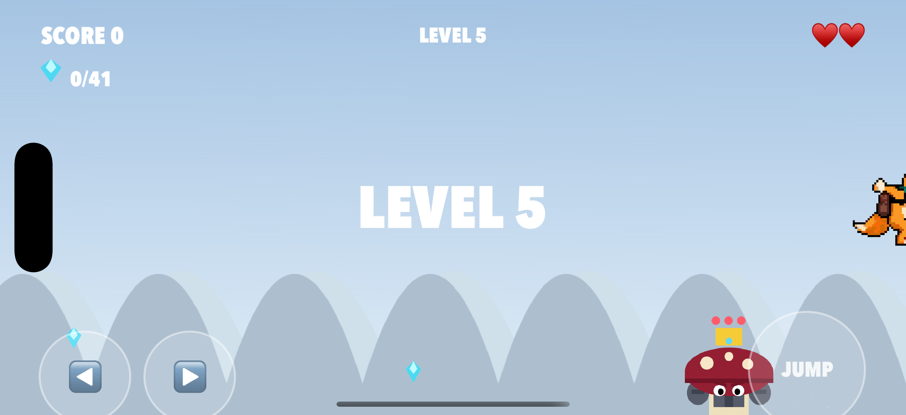

# Crystal Caper 🦊💎

**▶ [Play it now in your browser](https://ibrews.github.io/crystal-caper/)** — no install, works on desktop and mobile.

A complete, playable 2D pixel-art **platformer for iOS**, built with SpriteKit — and every sprite, animation, and tile is **AI-generated** via the [PixelLab](https://pixellab.ai) MCP. Run, jump, and stomp across **endless, procedurally-generated levels** that cycle through **forest, snow, and desert** biomes: ride **moving platforms**, grab crystals — each one dedicated to a real Agile Lens client — squash grumpy mushrooms, and topple **King Grumpcap**, a crowned, armored **boss** that caps every 5th level. Trigger **fireworks** by collecting every crystal (or by defeating the boss), chase your **personal best**, and post to an optional **shared online high-score board** — all to a chiptune soundtrack.

It's a showcase of the full **asset → game pipeline**: pixel art is generated on demand, dropped into the project, and wired into a physics-driven game with camera follow, parallax, particles, and a touch + keyboard control scheme.

Built by **Alex Coulombe Presents** ([ibrews](https://github.com/ibrews)).



<p align="center">
  
  
</p>

| | |
|---|---|
| **Engine** | SpriteKit (SwiftUI `SpriteView` host) |
| **Target** | iOS 17+ · iPhone & iPad · landscape |
| **Assets** | PixelLab MCP (characters, animations, tileset) |
| **Audio** | Chiptune SFX + music, synthesized in pure Python |
| **Web** | HTML5/Canvas port → GitHub Pages, procedurally-generated levels |
| **Gameplay** | Moving platforms, a 3-hit boss every 5th level, 3 biomes, fireworks |
| **Leaderboard** | Personal best + optional shared online board ([Cloudflare Worker + KV](leaderboard/)) |
| **Project** | Generated with [XcodeGen](https://github.com/yonaskolb/XcodeGen) |

<p align="center">
  
</p>

## Play

- **In a browser (anyone, no install):** **[ibrews.github.io/crystal-caper](https://ibrews.github.io/crystal-caper/)** — the full game runs in HTML5/Canvas, reusing the exact same AI-generated art. Desktop: arrow keys / `WASD` + `Space`. Mobile: on-screen ◀ ▶ JUMP.
- **On iOS (the original SpriteKit build):** follow the Quickstart below.
- **Global leaderboard:** your **personal best** works out of the box; a **shared online top-20** (web + iOS, one source of truth) lights up once the tiny [Cloudflare Worker backend](leaderboard/) is deployed — one `wrangler deploy` plus setting the URL in each client (see [`leaderboard/README.md`](leaderboard/README.md)).

## Quickstart (iOS / Xcode)

```bash
# 1. Generate the Xcode project (project.yml → .xcodeproj)
cd CrystalCaper
xcodegen generate

# 2. Build & run on a booted simulator
xcodebuild -project CrystalCaper.xcodeproj -scheme CrystalCaper \
  -destination 'platform=iOS Simulator,name=iPhone 17' build

# 3. Or just open it and hit ⌘R
open CrystalCaper.xcodeproj
```

## Controls

- **On-screen:** ◀ ▶ pads (bottom-left) to move, **JUMP** (bottom-right) to jump.
- **Hardware keyboard** (great in the simulator): `A`/`←` and `D`/`→` to move, `Space`/`W`/`↑` to jump.
- **Attract / self-test mode:** launch with `CC_AUTOPLAY=1` set and an autopilot plays the level hands-free — used for headless on-device verification.

## Things to Try

1. **Reach the flag.** Run right across three pits and three patrolling mushrooms to the checkered goal flag. Watch the win screen tally your gems and award a per-life bonus.
2. **Stomp a mushroom.** Jump and come down *on top* of a Grumpcap — it squashes and pops for +250. Touch one from the side instead and you'll lose a heart (with a brief invulnerability blink).
3. **Go for the high route.** The second floating step (top-right of ground C) holds two bonus crystals that need a precise full-height jump to reach.
4. **Feel the jump assists.** Walk off a ledge and tap jump a hair late — *coyote time* still launches you. Tap jump just before landing — the *jump buffer* fires it on touchdown.
5. **Fall in a pit on purpose.** You'll respawn at the start, down a heart. Lose all three and the Game Over screen appears — tap anywhere to play again.
6. **Ride a moving platform.** From **level 4** up, some floating ledges drift back and forth (or up and down). Hop aboard — it carries you along its path. Time your jump off to reach crystals you couldn't otherwise.
7. **Beat the boss.** Every **5th level** (5, 10, 15…) the goal flag is gated by **King Grumpcap**. He pauses and flashes red (a tell), then charges or lobs a slow spore. Stomp his head **3 times** — dodge the side hits — for a big bonus, fireworks, and the goal that opens behind him.
8. **Make the global board.** Once the [leaderboard backend](leaderboard/) is deployed, your final score (initials + level reached) posts to a **shared online high-score board** shown on the title and game-over screens — chase the worldwide top 20, not just your own best.

## Asset Pipeline

Sprites live in `Resources/` as flat PNGs, loaded by name (`pip_idle_0.png`, `grump_walk_0.png`, `tile_surface.png`, …). Every art asset was generated with the PixelLab MCP:

- **Pip the Fox** — humanoid side-view character + `idle`, `run`, `jump` animations (east-facing; mirrored for west).
- **Grumpcap** — mushroom enemy + `walk` animation.
- **King Grumpcap** — the boss (every 5th level): a larger, crowned, armored mushroom. Currently a hand-drawn procedural placeholder (`bossPlaceholder()` in `Assets.swift`, mirrored on Canvas in the web port) to conserve the PixelLab trial budget; the loader adopts real `boss_*.png` frames automatically if they're generated later.
- **Forest tileset** — a 16-tile Wang sheet, sliced + composited into a grass-capped surface tile and a dirt fill tile.
- **Sound effects** — five chiptune SFX (jump, gem, stomp, hurt, win) synthesized in pure Python, no samples.

Until a real asset is present, `Assets.swift` draws a hand-coded procedural placeholder of the same proportions, so the game is fully playable at every stage of integration. The full, reproducible pipeline (PixelLab IDs + the slicing/synthesis scripts) is documented in [`Tools/README.md`](Tools/README.md).

## Project Layout

```
Sources/
  CrystalCaperApp.swift   App entry (landscape, full-screen)
  GameView.swift          SwiftUI SpriteView host
  GameConfig.swift        All tuning constants + physics categories + Z layers
  GameScene.swift         World build, physics, input, camera, moving platforms, win/lose
  Player.swift            Hero entity + animation state machine
  Enemy.swift             Patrolling mushroom
  Boss.swift              "King Grumpcap" boss state machine (telegraph/charge/projectile)
  Collectibles.swift      Gem + goal flag factories
  LevelData.swift         Level structs + procedural generator (incl. moving platforms)
  Assets.swift            Texture loading + procedural placeholders
  Effects.swift           Particle bursts + floating score text
  Leaderboard.swift       Shared online high-score client (URL-flag-gated)
  ParallaxBackground.swift  Scrolling sky + hill bands
Resources/                Generated PixelLab PNGs
leaderboard/              Cloudflare Worker + KV backend (deploy + test harness)
Tools/web_harness.mjs     Headless validator for the web port (genLevel + game loop)
```

## Support

If you like seeing this kind of thing get built and shared, [donations are always welcome](https://www.alexcoulombepresents.com/support) — they buy hardware, render time, and the freedom to keep giving most of this away.
